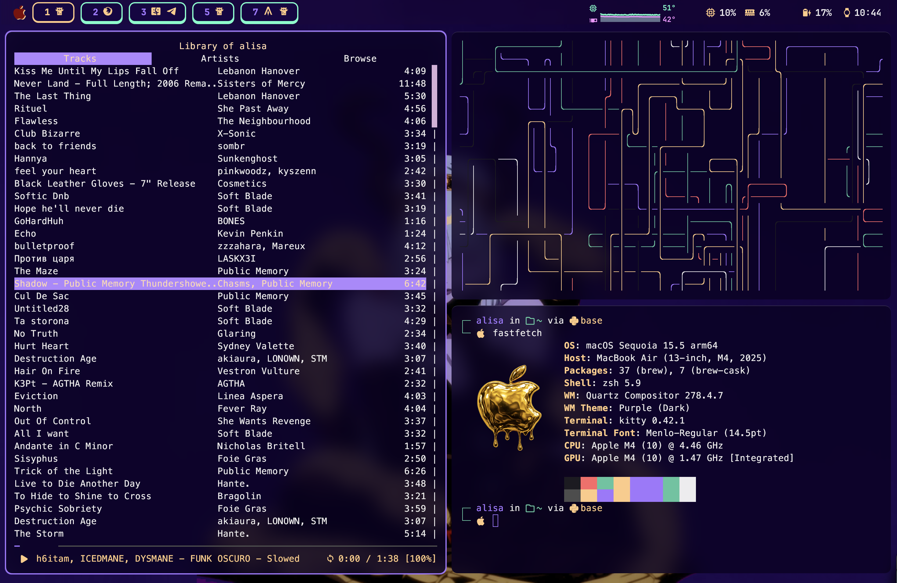
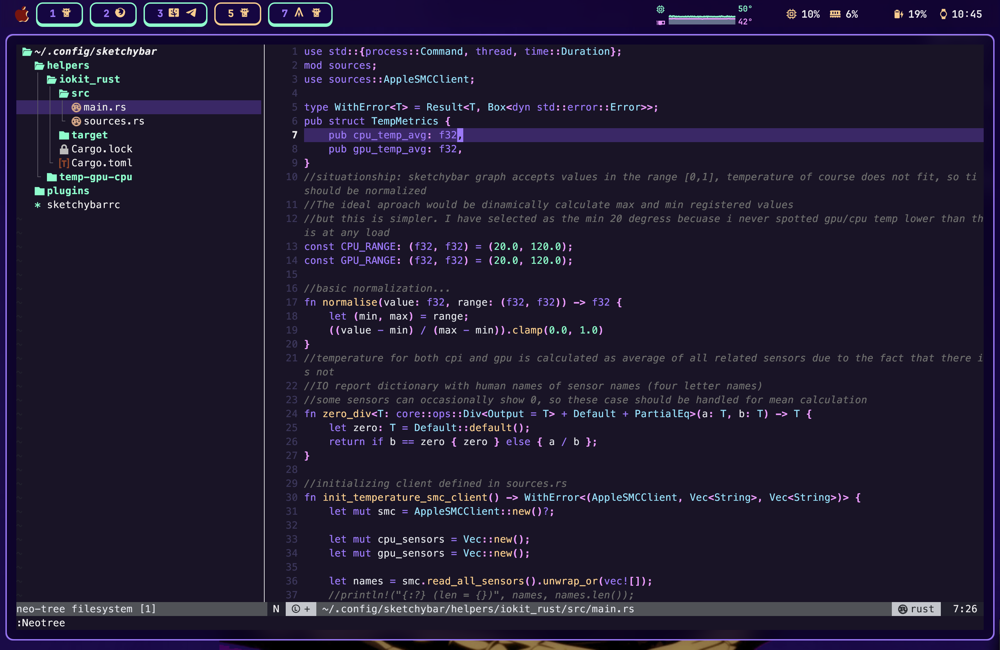
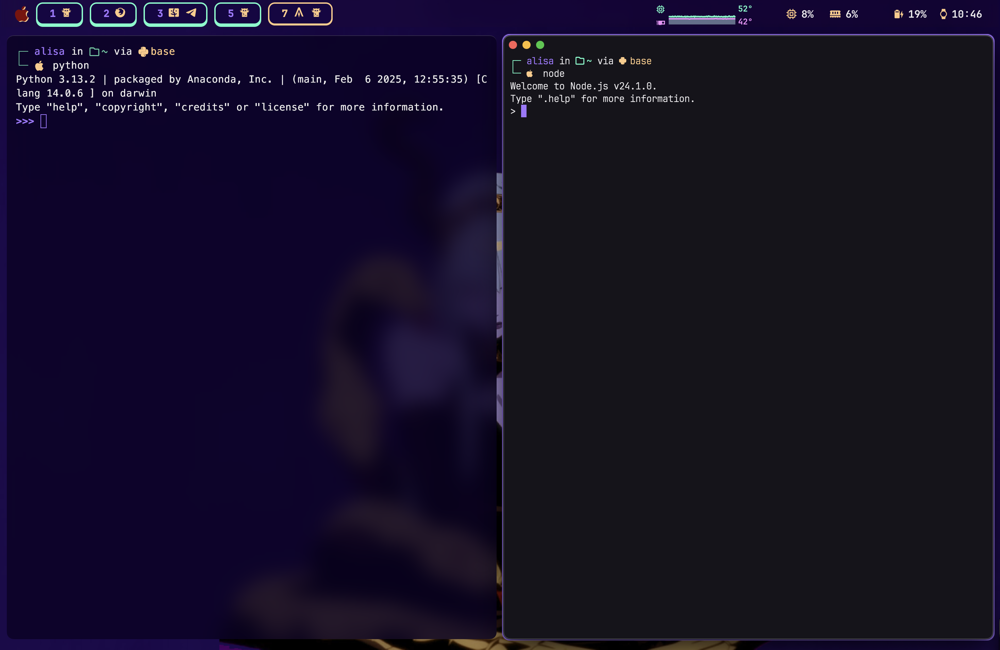
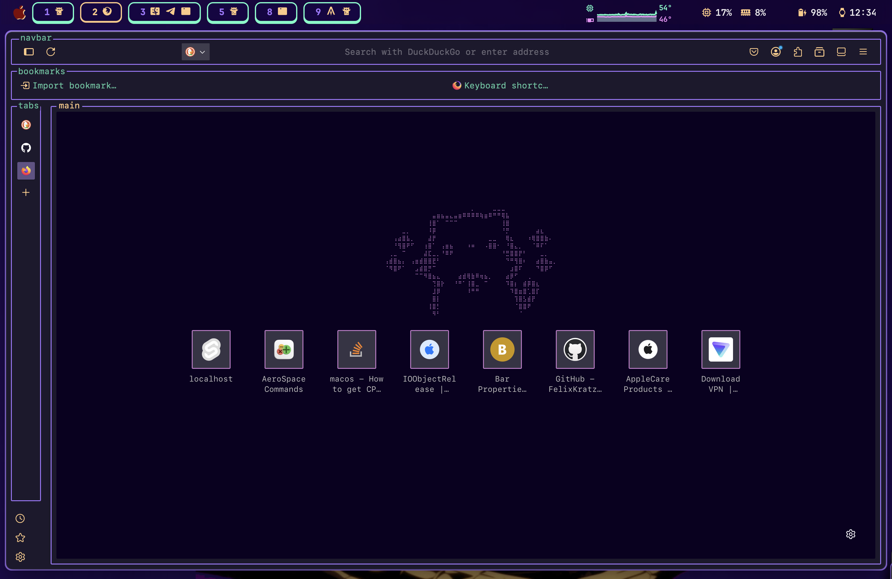

# MacOS UI customization with AeroSpace (tiling window manager) and SketchyBar (status bar)

## 1️⃣ Setup in action

SketchyBar zoomed:

Some other screenshots:

|  |  |
|:------------------------------:|:-------------------------------:|
|  |  |

**Straight to the point**: all configurations live in folders named after the app they belong to. SketchyBar and AeroSpace folders contain markdown files, written in a wiki style. SketchyBar’s configs are simple and minimalistic, written in shell scripts (NOT LUA!). SketchyBar is configured to show only non-empty AeroSpace workspaces, react to newly opened workspaces, and display icons of apps open in each workspace without duplicates (e.g., if you have three Kitty terminals open in workspace 1, you’ll see just one Kitty icon). The AeroSpace "wiki" includes notes on what to add/modify compared to the default config - so you don’t have to copy everything from this repo thoughtlessly.

## 2️⃣ List of what you see (apps, tools) & links & credits

None of the mentioned below apps or tools was built from source; they were installed using [Homebrew, package manager for MacOS](https://brew.sh/) 

#### ‼️ *Please don’t be greedy with GitHub stars. If you use any open-source software/content, at least give it a star*

UI:

&nbsp;&nbsp;&nbsp;⭐ Window manager: [AeroSpace](https://github.com/nikitabobko/AeroSpace) by [nikitabobko](https://github.com/nikitabobko) 

&nbsp;&nbsp;&nbsp;⭐ Status Bar: [SketchyBar](https://github.com/FelixKratz/SketchyBar) by [FelixKratz](https://github.com/FelixKratz) 

&nbsp;&nbsp;&nbsp;⭐ Styled border for focused window: [JankyBorders](https://github.com/FelixKratz/JankyBorders) by [FelixKratz](https://github.com/FelixKratz)

&nbsp;&nbsp;&nbsp;⭐ Color theme: [Aura Dark theme](https://github.com/daltonmenezes/aura-theme) by [daltonmenezes](https://github.com/daltonmenezes)

Terminal-related stuff:

&nbsp;&nbsp;&nbsp;⭐ Terminal: [Kitty](https://sw.kovidgoyal.net/kitty/) by [kovidgoyal](https://github.com/kovidgoyal)

&nbsp;&nbsp;&nbsp;⭐ Shell: zsh, customized with [Oh My ZSH!](https://github.com/ohmyzsh/ohmyzsh) 🔹 [Documentation](https://github.com/ohmyzsh/ohmyzsh/wiki); Prompt style: custom (see .zshrc)

Terminal Apps:

&nbsp;&nbsp;&nbsp;⭐ Resource monitor: [btop++](https://github.com/aristocratos/btop) by [aristocratos](https://github.com/aristocratos)

&nbsp;&nbsp;&nbsp;⭐ Terminal Spotify player: [ncspot](https://github.com/hrkfdn/ncspot) by [hrkfdn](https://github.com/hrkfdn)

&nbsp;&nbsp;&nbsp;⭐ Terminal screensaver: [pipes.sh](https://github.com/pipeseroni/pipes.sh)

&nbsp;&nbsp;&nbsp;⭐ Terminal file manager: [yazi](https://github.com/sxyazi/yazi) by [sxyazi](https://github.com/sxyazi)

&nbsp;&nbsp;&nbsp;⭐ Performance monitoring for Apple Silicon processors: [macmon](https://github.com/vladkens/macmon) by [vladkens](https://github.com/vladkens)

Code Editor:

&nbsp;&nbsp;&nbsp;⭐ [Neovim](https://github.com/neovim/neovim); configuration: [kickstart.nvim](https://github.com/nvim-lua/kickstart.nvim)

Web: 

&nbsp;&nbsp;&nbsp;⭐ Brave Browser

&nbsp;&nbsp;&nbsp;⭐ Mozilla Firefox with customized look via [textfox](https://github.com/adriankarlen/textfox) by [adriankarlen](https://github.com/adriankarlen)

CPU&GPU temperature sensors data:

&nbsp;&nbsp;&nbsp;⭐ Rust crate

## 3️⃣ Specs of My MacBook

💻 MacBook Air 13" M4 chip, macOS version 15.5 (Sequoia)

Why this matters: 
- **Sequoia**: New features that touched the management and nature of macOS native virtual desktops were introduced; however, with my setup I do not experience any malfunctions.

- **Chip (M4):** My resource monitoring tools, which I’m used to using on Debian, do not provide temperature metrics for the CPU and GPU. Activity Monitor shows nothing. There are some third-party applications (some free, some paid); however, most of them do not guarantee temperature metrics for the latest M4 chips.

## 4️⃣ Be aware! I am a Debian princess (linuxoid)

I administer my MacBook in a very Linux way, so please do not ask me about an impact of this setup on some particular native MacOS features, gestures, and other macOS-specific stuff.
I save files from web with wget, not with Drag&Drop functionality. 

**What I use my MacBook Air for:**
- Web development
- Practicing algorithms in JS/Python and a bit of Rust

## 5️⃣ What’s the matter with CPU&GPU temperature?

If you’re using a MacBook Pro, you have fans, so overheating is rarely a concern. MacBook Airs, however, rely on passive cooling (no fans). They’re super silent, but eventually they can silently get "cooked". No drama, but an overheated CPU will throttle itself (its performance gets reduced). If you’re using your MacBook Air for everyday tasks with well-behaved apps, you usually won’t encounter an issue that your laptop got very hot. However, experimenting with new third-party software can push the CPU hard and cause excessive heat (if apps are poorly optimized for resource usage). 

Without temperature metrics, all you have is the sense that your laptop is hot. But if you’re juggling multiple tasks and suddenly feel it heating up, you start asking: Why is it getting hot? What exactly is the cause? Was it just some spike that occured right now, or did it happen a bit earlier? It’s hard to answer such questions if you can’t monitor actual temperature metrics over time.

